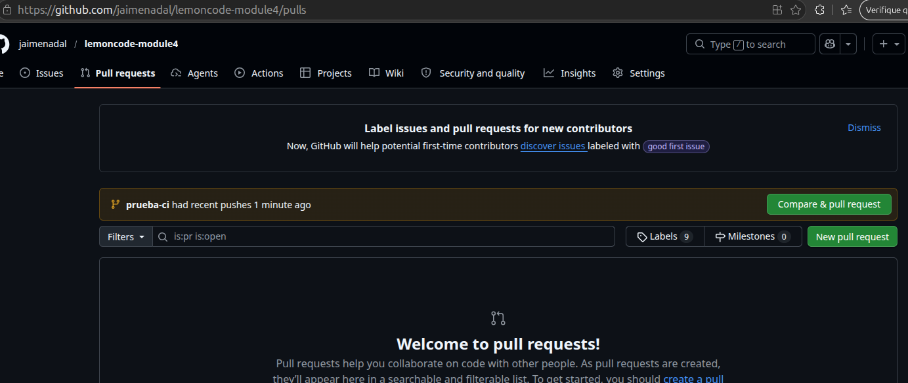
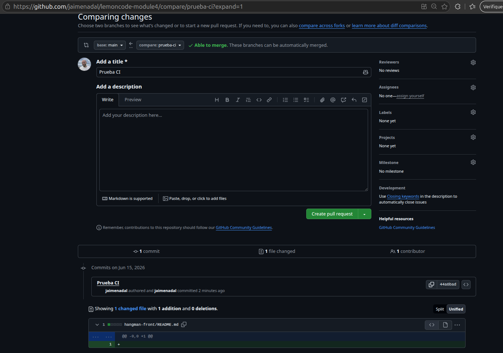
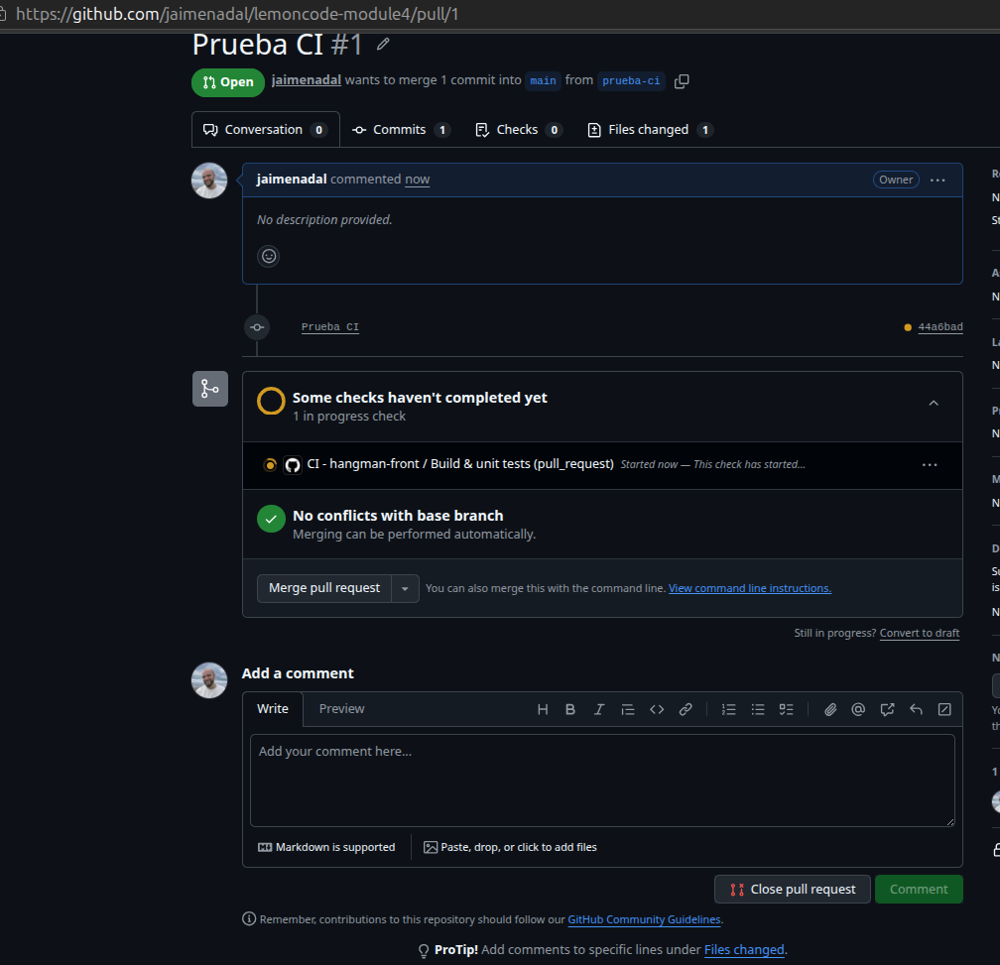
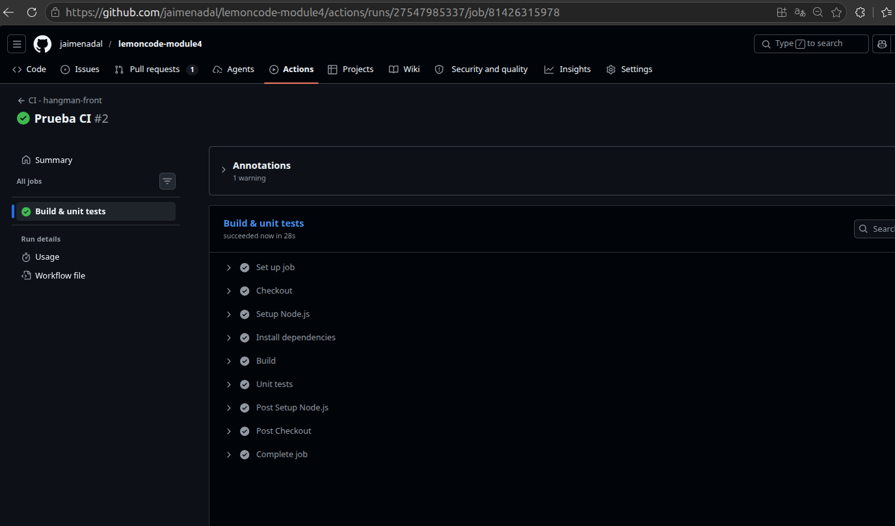
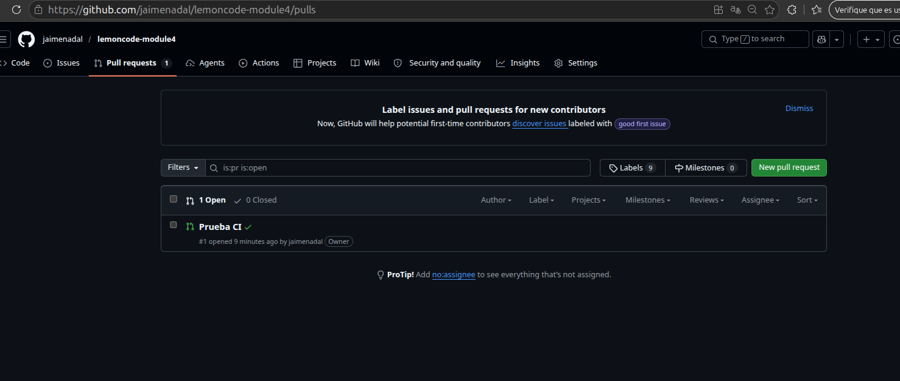
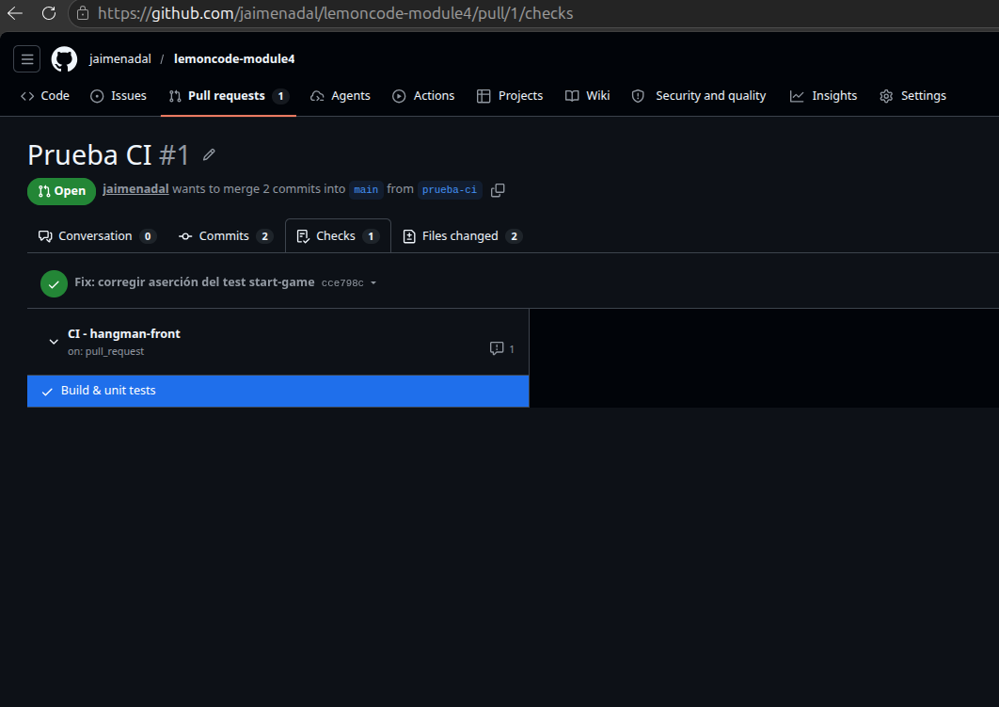
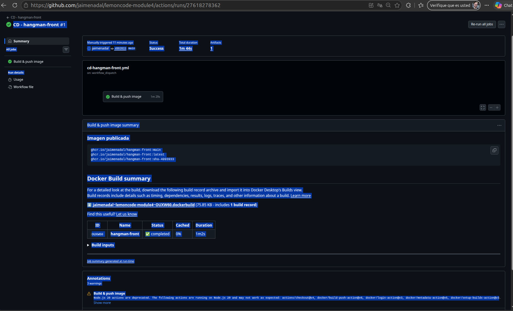
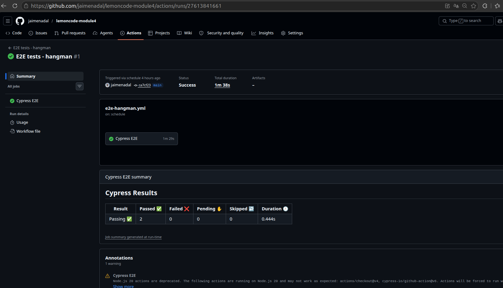

# GitHub Actions — Ejercicios

Tres workflows para el frontend del juego Hangman:

- **CI** del front (obligatorio) — build y tests unitarios en cada PR que toque el directorio `hangman-front/`.
- **CD** del front (obligatorio) — build de imagen Docker y push a GitHub Container Registry, lanzado manualmente.
- **E2E** con Cypress (opcional 3) — levanta front + api con Docker Compose y ejecuta los tests de Cypress.

## Estructura del repositorio asumida

Los workflows se han diseñado para vivir en un repositorio que tiene la siguiente estructura:

```
.
├── .github/workflows/
│   ├── ci-hangman-front.yml
│   ├── cd-hangman-front.yml
│   └── e2e-hangman.yml
├── hangman-front/              ← código del front (npm + Dockerfile)
├── hangman-api/                ← código de la api (con Dockerfile propio)
└── hangman-e2e/
    ├── docker-compose.e2e.yml
    └── e2e/                    ← proyecto Cypress
```

El código del front, la api y los tests viene del bootcamp:
`Lemoncode/bootcamp-devops-lemoncode/03-cd/03-github-actions/.start-code/`.

## CI — `ci-hangman-front.yml`

Se dispara solo cuando se cumplen las **dos** condiciones a la vez:

1. La acción es una `pull_request` contra `main`.
2. La PR toca al menos un archivo dentro de `hangman-front/`.

Esa combinación es el comportamiento que pide el enunciado. Las dos condiciones tienen que darse juntas, no por separado.

### Probarlo

1. Crea una rama `prueba-ci`.
2. Cambia cualquier cosa en `hangman-front/` (un comentario en el README sirve).
3. Empuja la rama y abre una PR contra `main`.

El workflow aparece en *Checks* de la PR en cuanto se abre. Pasa por: install (`npm ci`) → build (`npm run build`) → unit tests (`npm test`).








## CD — `cd-hangman-front.yml`

Se dispara manualmente desde la pestaña **Actions** de GitHub. Construye la imagen y la publica en `ghcr.io/<owner>/hangman-front` con varios tags.

### Probarlo

1. Pestaña **Actions** → workflow *CD - hangman-front* → botón **Run workflow**.
2. (Opcional) introduce un tag adicional, por ejemplo `v0.1.0`.
3. Pulsa **Run workflow** y espera al verde.

Si todo ok, la imagen aparece en la pestaña **Packages** de tu perfil/organización en GitHub. Para tirar de ella desde tu máquina:

```bash
# Si el paquete está en modo privado (por defecto), hay que autenticarse antes.
# Genera un PAT con scope `read:packages` en GitHub → Settings → Developer settings.
echo $CR_PAT | docker login ghcr.io -u <tu-usuario> --password-stdin

docker pull ghcr.io/<tu-usuario>/hangman-front:latest
docker run -d -p 8080:8080 -e API_URL=http://localhost:3001 ghcr.io/<tu-usuario>/hangman-front:latest
```



### Tags generados

Por defecto, cada ejecución genera 2-3 tags:

- `sha-abc1234` — trazabilidad por commit, **inmutable**.
- `main` (o el nombre de la rama) — siempre apunta al último build de la rama.
- `latest` — solo cuando se lanza desde `main`.
- El tag opcional que pases por input (si lo introduces).

El tag inmutable `sha-…` es el que conviene referenciar en producción (o mejor aún, el digest `@sha256:…`). Los tags mutables (`main`, `latest`) son cómodos en dev pero no garantizan que mañana sigas tirando del mismo bit.

## E2E — `e2e-hangman.yml`  (opcional 3)

Construye front + api, levanta el stack con Docker Compose, espera a que ambos respondan, y dispara Cypress contra `http://localhost:8080`.


### Disparadores

- Manual desde la pestaña Actions.
- Programado a las 06:00 UTC todos los días.

### Probarlo en local antes de subirlo

```bash
# Construye las imágenes
docker build -t hangman-api:e2e   ./hangman-api
docker build -t hangman-front:e2e ./hangman-front

# Levanta el stack
docker compose -f hangman-e2e/docker-compose.e2e.yml up -d

# Ejecuta Cypress (esta vez sí en modo interactivo si quieres ver la UI)
cd hangman-e2e/e2e
npm ci
npm run open    # interactivo (lo que pide el enunciado para probar en local)

# Al acabar:
cd ../..
docker compose -f hangman-e2e/docker-compose.e2e.yml down -v
```


## Sobre el Dockerfile de hangman-front

El [`Dockerfile`](hangman-front/Dockerfile) está basado en el que **ya trae el proyecto del bootcamp**, no es una plantilla genérica. Confirmado contra el código real del repo:

> **Para que la imagen funcione necesitas los archivos del repo** junto al Dockerfile: `nginx.conf` y `entry-point.sh`. Cópialos del `.start-code/hangman-front` del bootcamp al directorio de tu front. El Dockerfile de este entregable los espera en esas rutas.
